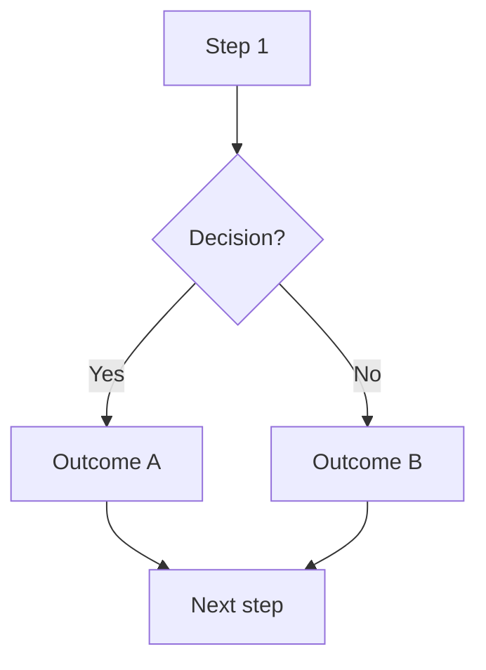

# Process Definition: [Product / Feature Area] — MVP

**Version:** 0.1 (draft)
**Date:** [date]
**Source:** Discovery interview ([link to interview file]), strategic context ([link to context file])

---

## Contents

1. [Reference Data](#reference-data)
2. [Process 1: Name](#process-1-name)
3. [Process 2: Name](#process-2-name)
4. [Roadmap / Backlog](#roadmap--backlog)
5. [Open Questions (TODO)](#open-questions)

---

## Reference Data

<!-- Extract all numbers, categories, frequencies, and capacities mentioned during discovery.
     This section is the single source of truth for business parameters. -->

### [Category 1 — e.g., User types, Membership tiers, Frequencies]

| Parameter | Value | Notes |
|---|---|---|
| ... | ... | ... |

### [Category 2]

| Parameter | Value | Notes |
|---|---|---|
| ... | ... | ... |

---

## Process 1: [Name]

### 1.1 Description

<!-- Plain-language description of what this process does, who's involved, and why it matters. 2–4 sentences. -->

### 1.2 Process Flow



### 1.3 Business Rules

| Rule | Definition |
|---|---|
| **Rule name** | Specific, measurable definition |
| **Rule name** | Specific, measurable definition |

### 1.4 Calculations

**[Calculation name]:**

```
formula = ...
```

Example: [concrete example with real numbers]

### 1.5 Entity States

| State | Meaning |
|---|---|
| `state_name` | What this state means |
| `state_name` | What this state means |

---

## Process 2: [Name]

<!-- Same structure as Process 1: Description, Flow, Rules, Calculations, States -->

### 2.1 Description

### 2.2 Process Flow

### 2.3 Business Rules

### 2.4 Calculations

### 2.5 Entity States

---

<!-- Add more processes as needed. Each follows the same 5-part structure. -->

## Roadmap / Backlog

Items not in MVP scope. Each has a title, description, and business impact.

### R1: [Feature name]

[What it does, why it matters, approximate priority]

### R2: [Feature name]

[What it does, why it matters, approximate priority]

---

## Open Questions

Questions that must be answered to finalize the process definition. Each is numbered, specific, and assigned to a person.

### Area 1: [Area name]

| # | Question | For whom |
|---|---|---|
| TODO-1 | [Specific, answerable question] | [Name / Role] |
| TODO-2 | [Specific, answerable question] | [Name / Role] |

### Area 2: [Area name]

| # | Question | For whom |
|---|---|---|
| TODO-3 | [Specific, answerable question] | [Name / Role] |

---

## Tasks

| # | Task | Who | Status |
|---|---|---|---|
| TASK-1 | [Action item — e.g., Upload document X] | [Name] | Pending |

---

<!-- Optional sections — add as needed during Phase 6 (Cross-reference) -->

## [Reference Document] vs. Process Definition

<!-- Added during Phase 6 when cross-referencing against contracts, terms, legal docs. -->

### Confirmations

| Area | Document reference | Process definition | Status |
|---|---|---|---|
| ... | Article X.Y | Process N, rule Z | Matches |

### Discrepancies

**Discrepancy #1 — [Title]**

- **Document says:** ...
- **Process definition says:** ...
- **Resolution:** ...

### Additions from [Document]

**1. [Addition title]**

[What the document says that's missing from the process definition. How to integrate it.]

---

## Dependencies

<!-- What does this product need from other systems or modules to function? -->

| Dependency | Status |
|---|---|
| [System / module name] | [Available / In progress / TODO] |
