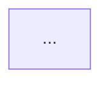

# User Flow Visualizer

## Co tento skill dělá

Ze zadání (slovní popis, poznámky, existující dokumentace) vytvoří:

1. **Markdown spec** — kompletní specifikace všech flows s Mermaid diagramy a edge casy
2. **Sadu HTML prototypů** — index + jedna stránka per flow, vizuálně mockupující každý krok
3. **Lokální HTTP server** — pro bezproblémové prohlížení v browseru

---

## Fáze 1 — Průzkum a discovery

### Nejprve prozkoumej projekt

Před jakýmkoli psaním:
- Existuje design systém? (CSS soubory, design tokens, `theme.css`, Tailwind config, brand guide)
- Existují již nějaké flow dokumenty nebo prototypy? Přečti je — nevytvárej duplikáty
- Jaká je technologie projektu? (Next.js, React, plain HTML — ovlivní terminologii ve spec)
- Kde je rozumné místo pro výstupní soubory?

### Porozumění flows

Pokud zadání není kompletní, ptej se na:
- Jaké jsou role uživatelů? (admin, hráč, host, organizátor…)
- Jaký je vstupní bod každého flow? (landing page, invite link, e-mail…)
- Jaké jsou klíčové výstupy každého flow? (přihlášení, platba, členství…)
- Co se stane při chybách? (neplatný kód, expirovaný odkaz, zakázaný přístup…)

**Neptej se na vše najednou.** Jedna otázka → odpověď → další. Pokud je zadání dostatečné, přejdi přímo k návrhu.

---

## Fáze 2 — Edge case audit

Před psaním spec systematicky projdi každý flow a hledej skuliny:

**Autentizace a registrace:**
- Co se stane s expirovaným ověřovacím kódem? Je tam "Poslat znovu"?
- Vytvářejí se tiše nové účty bez vědomí uživatele? (OTP pro nové e-maily)
- Může uživatel odmítnout akci, která se mu automaticky nabízí?

**Join / onboarding flows:**
- Může uživatel odmítnout pozvánku? Je to viditelné v UI?
- Co se stane s neplatným nebo expirovaným invite kódem?
- Co uvidí uživatel bez kódu na stránce určené pro pozvané?

**Systémové race conditions:**
- Co se zobrazí, když backend ještě nezpracoval předchozí krok? (webhook, platba…)
- Je tam polling nebo loading stav?

**Sdělení uživateli:**
- Je každý automatický proces (vytvoření účtu, přidání do skupiny) explicitně komunikován?
- Jsou chybové zprávy specifické, nebo jen "Něco se pokazilo"?

Každou nalezenou skulinu zachyť jako pojmenovaný edge case (EC-1, EC-2…) a zahrň do spec i prototypů.

---

## Fáze 3 — Markdown spec

Ulož do `{výstupní-složka}/spec/flows-spec.md`.

### Struktura spec souboru

```markdown
# {Název projektu} — {Oblast} Flow Spec
date: YYYY-MM-DD

## Základní principy
(max 4 odrážky — klíčová architektonická rozhodnutí)

## Celková mapa aplikace
(Mermaid flowchart — všechny flows najednou)

## Flow A — {Název}
**URL:** ...  **Role:** ...

### Kroky
(číslovaný seznam)

### Formulář / UI prvky
(tabulka: Pole | Validace | Poznámka)

### Chybové stavy
(tabulka: Stav | Zpráva)



(opakuj pro každý flow)

## Edge casy a skuliny
### EC-1 — {Název} ⚠️ CHYBÍ / ✅ VYŘEŠENO
**Problém:** ...
**Dopad:** ...
**Řešení:** ...


## Datový model (relevantní tabulky)
## Přehled URL vstupů
## Otevřené otázky
```

---

## Fáze 4 — HTML prototypy

### Výstupní struktura

```
{výstupní-složka}/prototypes/
├── theme.css          (design tokens — viz níže)
├── index.html         (rozcestník)
├── flow-a-{název}.html
├── flow-b-{název}.html
└── ...
```

### Detekce design systému

**Pokud projekt má vlastní design systém:**
- Přečti CSS/token soubory, extrahuj barvy, fonty, border-radius, spacing
- Použij stejné hodnoty v `theme.css` — prototypy mají vypadat jako součást projektu
- Napiš `theme.css` jako wrapper: `@import` původní tokeny + doplň chybějící proměnné

**Pokud projekt nemá design systém:**
- Použij výchozí design z `references/default-theme.md`
- Zvol tmavé nebo světlé téma podle kontextu (admin → tmavé, consumer → světlé)

### index.html — rozcestník

Obsahuje:
- Název projektu + oblast (např. "Auth & Login Flows")
- Kartičky pro každý flow: tag (Flow A / B…), role (Admin / Hráč), název, popis, seznam kroků jako pills, odkaz "Zobrazit flow →"
- Sekce základních principů (3–4 kartičky)
- Barevné rozlišení rolí (admin = gold/amber, player/user = teal/blue, systém = muted)

### flow-{x}-{název}.html — jednotlivý flow

Každá stránka obsahuje:
- Nav: Logo / název flow / "← Zpět na přehled"
- Header: flow tag, název, krátký popis
- **State machine** (pokud flow má více stavů): vizuální grid karet — každý stav jako karta s názvem, popisem, barevným označením. Nové stavy (z edge casů) výrazně označit.
- **Hlavní flow**: kroky jako vertikální timeline s číslovanými uzly a spojnicemi. Každý krok = číslo + název + mock screen + (volitelně) sub-stavy nebo větvení.
- **Mock screens**: simulované okno browseru (traffic lights + URL bar) s realistickým UI — formuláře, tlačítka, OTP inputy, stripe embed, admin panely, player views…
- **Edge cases**: vizuálně odlišené (amber/orange barva, EC badge), zobrazené jako větve nebo výsledkové karty
- **Poznámky k implementaci**: na konci stránky, s border-left accent

### Mock screens — jak je dělat

Mock screen = zmenšená simulace skutečné obrazovky. Vždy obsahuje:
- Browser bar se třemi tečkami (červená/žlutá/zelená) a URL
- Obsah: realistická, ne schematická data (skutečná jména, skutečné hodnoty, ne "Lorem ipsum")
- Stav: ukaž konkrétní moment ve flow (vyplněný formulář, loading stav, chybovou zprávu…)

Pro každý edge case ukaž jak vypadá chybový stav v UI — konkrétní text zprávy, ne jen "[error message here]".

### Technická pravidla pro HTML soubory

- Všechna CSS v `<style>` tagu nebo v lokálním `theme.css` — žádné CDN linky na CSS frameworky (mohou selhat offline)
- Google Fonts přes `@import` v CSS je OK (načte se když je internet)
- Žádný JavaScript framework — plain JS pro případné interakce
- `theme.css` musí být ve stejné složce jako HTML soubory (`href="./theme.css"`)
- Fonty v prototypech: vždy přes Google Fonts `@import` — nikdy system-ui nebo Arial jako primární font

---

## Fáze 5 — Spuštění serveru

Po vytvoření souborů vždy automaticky:

```bash
# Zabij starý server pokud běží na stejném portu
lsof -ti:8765 | xargs kill -9 2>/dev/null || true

# Spusť server
cd "{výstupní-složka}/prototypes" && python3 -m http.server 8765 &>/tmp/flow-server.log &

# Otevři v browseru
sleep 1 && open "http://localhost:8765/index.html"
```

Sdělení uživateli: "Otevřeno na http://localhost:8765 — server běží na pozadí."

---

## Výstupní shrnutí

Po dokončení uveď:
- Kolik flows bylo zdokumentováno
- Kolik edge casů bylo nalezeno a zachyceno
- Kde jsou soubory (spec + prototypy)
- URL serveru

Nekomentuješ každý soubor zvlášť. Jedno stručné shrnutí.
